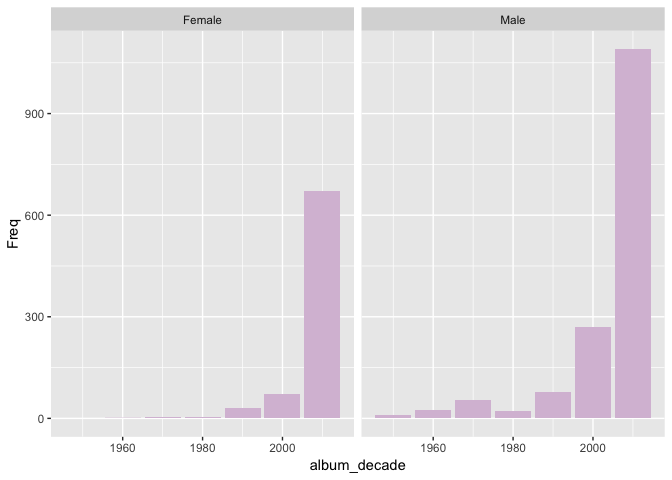
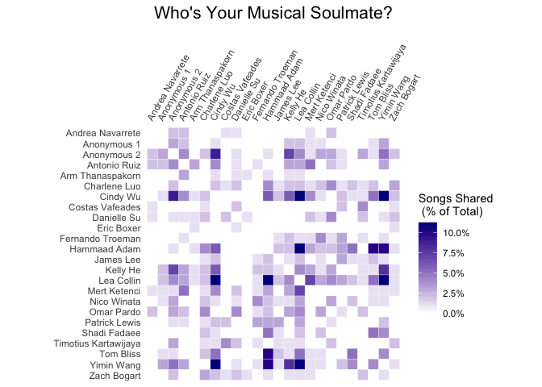

Note: All of the code for this project can be found [here](https://github.com/LeaCollin0518/EDAV-FinalProject).


## I. Introduction

The focus of our final project is exploring the music tastes of our classmates here at Columbia's Data Science Institute (DSI). We specifically chose to use the "Your Top Songs 2017" playlists that Spotify creates because this playlist is created for almost all Spotify users and it is static, so we would not have to worry about differences in the time we are pulling the playlists. This is a playlist with each user's 100 most listened to songs in 2017. With this dataset, we examined the listening patterns of our classmates, the different metrics of each song, how these metrics are correlated, and trends both within our class and in comparison with US/global populations. 

Our team members are Hammaad Adam, Lea Collin, Ling (Kelly) He, and Danielle Su. Lea contributed to cleaning the survey data and exploring what features make songs and artists popular for this year's class. Kelly worked on exploring general audio features of all the songs and some of the survey input data. Danielle worked on creating the initial data gathering survey and exploring trends within the class in terms of how students differ. Hammaad worked on exploring the commonalities and key differences between different students' playlists, by songs, artists, and genre. Danielle and Kelly also created the interactive D3 component of the project. All group members contributed to writing this report. 

## II. Data Description

Spotify's "Your Top Songs 2017" playlist was only created for users that met certain criteria: user listened to at least 5 different artists, 30 different tracks, and 60 minutes of music from January 1st to November 1st, 2017. An interesting implication of the dates used for this playlist is that all of December, and therefore likely a lot of holiday music, is not included in the data.
  
We collected our data using Spotify's API and spotifyr, a R wrapper, that was developed to be used with it.(For more information on the wrapper see [here](https://www.rcharlie.com/spotifyr/). Using spotifyr, you can input a user ID and a playlist ID, and extract all the metadata Spotify has on each track of the playlist. All of the essential attributes of the track are included, such as track name and artist name. In addition to that, Spotify also has their own calculated audio features for each track including: genre, danceability, valence, energy, loudness, and track popularity. A more thorough description of these features can be found under **Audio Features**, later on in this report.

In order to actually get the Spotify user IDs and playlist IDs for our classmates, we sent out a survey giving detailed instructions on how to provide this information. We also asked classsmates to optionally add information about themselves, such as age, gender, and nationality, so that we could explore whether there were any trends within these smaller subsets of our class population.

Note: since we compiled our own dataset, it is not publicly available on the internet, and we cannot provide a link to the source.

## III. Analysis of Data Quality

The quality of the data Spotify provided was excellent in terms of the number of missing values, the only features that had missing values were columns such as "album image", which was not used for our analysis. The downside to using Spotify's API is the dependency on Spotify's algorithms for determining audio feature data. For example, we know that a track's popularity value (ranging from 0 to 100) is calculated based on the total number of streams and the recency of those streams. Since this was our primary method of knowing the popularity of the track, we relied on its accuracy. However, if given more time for this project, we would have liked to explore other popularity measures such as Billboard top charts, Twitter activity, Instagram mentions, and music award recipients.

One primary issue of our dataset, is the small number of respondents to the survey. While 2400 tracks is a substantial amount in terms of audio features, it is only 24 students, so when trying to subset that population in terms of gender or age, the analysis is not robust. Another thing that we did not realize would be such a big factor is the fact that Spotify is not available in many countries, such as China and India, where a lot of our classmates were living in 2017.

Below, we look at the different missing data patterns. 


```r
library(extracat)
survey_data <- read_csv("StudentResponses.csv", col_names = TRUE)
```

```
## Parsed with column specification:
## cols(
##   Timestamp = col_character(),
##   Username = col_character(),
##   `Columbia Uni ID:` = col_character(),
##   `Age:` = col_integer(),
##   `Gender:` = col_character(),
##   `Nationality:` = col_character(),
##   `Location in 2017:` = col_character(),
##   `Undergraduate University:` = col_character(),
##   `How often would you say you used Spotify in 2017?` = col_integer(),
##   `Spotify User Name:` = col_character(),
##   `"Your Top Songs 2017" Playlist URI:` = col_character(),
##   `If you don't use Spotify or if you also you use other platforms to listen to music, please list what you use most frequently:` = col_character(),
##   `Should you have unique listening patterns in some way, would you agree to be mentioned by name in our project presentation to the class?` = col_character()
## )
```

```r
names(survey_data) <- c("Timestamp", "email", "uni", "age", "gender", "nationality", "location2017", "undergrad", "useFrequency", "username", "playlistID", "otherPlatform", "consent")
visna(survey_data, sort = 'b')
```

<!-- -->

As we can see from this plot, missing the "otherPlatform" variable (and no other variables) is the most common missing pattern in the survey data. The "otherPlatform" column was an optional survey question asking what people use for music-listening platforms apart from Spotify (such as Apple Music, Pandora, etc.). This information would be useful if we were to continue the project, we could explore other data from other music-listening platforms.

The second most common missing pattern is to not have any columns missing. Out of all the students that provided their Spotify information, one student mistakenly gave us a playlist other than the "Your Top Songs 2017", so we were unable to include him in our analysis. For the most part, this graph shows that we were able to capture the most pertinent information from our respondents. Though we were not able to collect as much data as we would have liked, the data we did collect was of fairly good quality in terms of the information we wanted to gather. 

We did quite a bit of analysis using artist's genre so we took a look at how many artists have this information available. As we see below, only 5.3%% of artists in the dataset have missing genre information, or 128 out of 2400 rows in the dataset.


```r
data_2 = data
data_2[which(data_2$artist_genres == "NULL"),] <- NA
print (sum(is.na(data_2$artist_genres))/nrow(data_2))
```

```
## [1] 0.05
```

```r
print (sum(is.na(data_2$artist_genres)))
```

```
## [1] 120
```

## IV. Main Analysis

### Data Cleaning

Before we get to the analysis, it is worth briefly dicussing our data cleaning process. The respondents to the survey were instructed on how to find, copy, and paste their user and playlist ID's from the Spotify application or Spotify webplayer. However, the actual ID's still needed to be extracted from the strings that were copied. In order to extract the ID's, we used R's **stringr** package and Regex. Once these ID's were extracted, it was straightforward to iterate through each ID, get the playlist features using the Spotify API, and progressively build up a dataframe with everyone's songs. We then pulled in additional information (e.g. album release date, genre) for each track, once again using the Spotify API. 

The code for these processes can be found on github here: 

[Data Cleaning](https://github.com/LeaCollin0518/EDAV-FinalProject/blob/master/lea-Work/DataCleaning.R)

[Getting Album Data](https://github.com/LeaCollin0518/EDAV-FinalProject/blob/master/CleaningAlbumData.Rmd)

[Getting Genre](https://github.com/LeaCollin0518/EDAV-FinalProject/blob/master/Hammaad-Work/DataImportGenre.R)

### Key Questions

Now that we've discussed our data collection and cleaning, let's dive into the analysis. Our data lends itself to a multitude of fascinating projects, and narrowing the scope of our focus was a real challenge. However, we ultimately decided to focus on the key questions that allow us to comprehensively characterize the music listening habits and tastes of our DSI class. To this end, our analysis was guided by four overarching questions: 

1. What are the distinctive features of a song that is popular within the DSI cohort?
2. How do DSI listening habits compare with US/global trends?
3. How similar are DSI students in their music preferences?
4. What are the key ways in which DSI students differ from one another?

### 1. What are the distinctive features of a song popular within the DSI cohort?

**Audio Features**

One of the main questions we wanted to address was "what makes a DSI song popular?" To begin answering this question, we examined the various audio features of the 2400 songs collected from our survey and how they correlate with each other and other survey input variables. In particular, we examined the following eight audio features: danceability, energy, loudness, valence, tempo, acousticness, speechiness, and instrumentalness. Most of these metrics have values between 0 and 1, representing the intensity of each variable (closer to 0 indicates low intensity and closer to 1 indicates high intensity). However, loudness and tempo needed to be normalized to values between 0 and 1. We excluded the liveness variable since it detects the presence of an audience in the recording rather than measuring any characteristic of the song, which we thought was not a particularly interesting feature. 

Descriptions of the chosen audio features:
1. **Danceability** describes how suitable a track is for dancing based on a combination of musical elements including tempo, rhythm stability, beat strength, and overall regularity.
2. **Energy** represents a perceptual measure of intensity and activity.
3. **Loudness** is the quality of a sound that is the primary psychological correlate of physical strength (amplitude). Values typical range between -60 and 0 db.
4. **Valence** describes the musical positiveness conveyed by a track.
5. **Tempo** represents the overall estimated tempo of a track in beats per minute (BPM).
6. **Acousticness** is a confidence measure of whether the track is acoustic.
7. **Speechiness** detects the presence of spoken words in a track.
8. **Instrumentalness** predicts whether a track contains no vocals.

First we took a holistic approach and created a parallel coordinates plot of all eight audio features of interest. We also thought it would be interesting to see if there are potential clusters or trends among these features conditioned on our survey input variables such as gender and location in 2017. 

Out of the 24 respondents, a third were female and the rest were male. In the parallel coordinate plot grouped by gender, we observe that each gender's audio feature behavior differs slightly. Specifically, female users tend to listen to music with low acousticness, speechiness, and instrumentalness, whereas the male behavior for those features is more varied. In general, all features are well spread out in the value range between 0 and 1, except for loudness, which skews high, and speechiness, which skews low.


```r
ggparcoord(df, columns = 1:8, alphaLines = .2, 
           scale = "uniminmax", groupColumn = "gender", splineFactor = 10) +
  ggtitle("Parallel Coordinates Plot by Gender") +
    theme_minimal(15) + theme(legend.position = "bottom") + 
      scale_color_manual(name="gender", labels = c("Female", "Male"), 
                          values = c("Female"="#663399", "Male"="#66FFFF")) +
        theme(axis.text.x = element_text(angle = 45, hjust = 1))
```

<!-- -->

We also created a parallel coordinate plot grouped by the location of the student in 2017 in order to determine whether the location of Spotify users affected their music tastes. Due to our limited data, we did not have enough geographic information for countries other the USA, so we decided to group all the other countries into one category called "OTHER". Half of the 24 users were in USA in 2017. The two country groups are more intertwined compared to the gender groups in the previous plot, indicating that country did not have as much impact on users' music taste as gender (at least as it pertains to our limited sample).


```r
ggparcoord(df, columns = 1:8, alphaLines = .2, 
           scale = "uniminmax", groupColumn = "clean_country", 
           splineFactor = 10) +
  ggtitle("Parallel Coordinates Plot by 2017 Location") +
    theme_minimal(15) + theme(legend.position = "bottom") +
      scale_color_manual(name="Country in 2017", labels = c("USA","OTHER"), 
                          values = c("USA"="#FF6666", "OTHER"="#3399FF")) +
        theme(axis.text.x = element_text(angle = 45, hjust = 1))
```

<!-- -->

After this initial assessment, we wanted to analyze the quantitative relationships between the audio features. The graphs below show the correlation between each pair of features. It's not surprising that energy and loudness are the most positively correlated features, while energy and acousticness are the most negatively correlated features. As the name suggests, acousticness is a measure of how likely the track is to be acoustic, and generally acoustic songs are considered to be more mellow and less high-energy.


```r
ggcorr(df[1:8], palette = "RdBu", label = TRUE, label_size = 2.5,
size = 3, legend.position = "bottom", hjust = 1) +
  theme_minimal(15) +
    ggtitle("How are audio features correlated?") 
```

<!-- -->


```r
scatter_vars <- ggpairs(cont_var, title = "", axisLabels = "show", progress = FALSE)
scatter_vars
```

<!-- -->

It is interesting to see that track popularity is not really correlated with any of the audio features. This again begs the question of what goes into calculating the track popularity variable, and perhaps whether it is a score relative to the genre the song belongs to. Spotify claims that it calculates danceability based on the tempo but not only is there almost no correlation between danceability and tempo, but they are even slightly negatively correlated! This might be interesting to look into further given more time.

**Popular Artists**

We now turn our attention to exploring the most popular artists of the dataset. We formulated two ways to measure popularity: how many songs each artist has in the combined playlist (i.e. all 2400 songs), and how many distinct playlists the artist appears in. The second is likely a better measure of overall popularity, as it is less sensitive to outliers - for example, if a student listens to many songs from that artist it might be a large percentage of the total combined playlist, but not necessarily and indication of popularity overall. The results of both these measures, however, are quite similar, as illustrated in the bar charts below. 


```r
ggplot(head(artist_df, 30) , aes(x=reorder(artist_name, -count), y= count)) +
geom_col(color="darkblue", fill="lightblue") +
  ggtitle("Which artist has the most songs in the data set?") +
    theme_minimal()+
      xlab("") + ylab("Number of songs") +
        theme(axis.text.x = element_text(angle = 45, hjust = 1))
```

<!-- -->


```r
#bar graph
ggplot(head(artist_df, 30) , aes(x=reorder(artist_name, -appearance), y= appearance)) +
  geom_col(color="darkblue", fill="lightblue") +
    ggtitle("Which artist appears in the most distinct playlists?") +
      theme_minimal() + xlab("") + ylab("Number of users") +
        theme(axis.text.x = element_text(angle = 45, hjust = 1))
```

<!-- -->

When looking at what makes an artist popular for DSI, we also wanted to see if the popularity of the artist on Spotify matched the popularity of the artist in DSI. To look at this, we have a density curve of artist popularity (Spotify's metric) between popular and less popular artists in DSI.


```r
lea_all_data <- rbind(edav_top_10_artists, edav_not_top_10_artists)

diff_art_pop <- ggplot(lea_all_data, aes(x = normalized_artist_pop, fill = playlist_name)) + 
  geom_density(alpha = 0.4) + xlab("Artist Popularity") + ylab("Density") +
  guides(fill=guide_legend(title="Playlist Name"))

diff_art_pop
```

<!-- -->

From this graph, we see that the artists that are popular with DSI students are also considered to be popular by Spotify, so DSI's aritst tastes match closely with the rest of Spotify users. 


```r
diff_art_dance <- ggplot(lea_all_data, aes(x = normalized_tempo, fill = playlist_name)) + 
  geom_density(alpha = 0.4) + xlab("Tempo") + ylab("Density") +
  guides(fill=guide_legend(title="Playlist Name"))

diff_art_dance
```

<!-- -->

From the graph above, we see something that is slightly inconsistent with what we saw with the most popular DSI songs. We see here that the most popular DSI artists actually have songs that are generally slower paced than less popular songs in DSI, which is an interesting discrepancy.

**Popular Genres**

Another interesting question to explore is how popular various genres are within the cohort. We plotted the 10 most popular genres below, along with the proportion of all songs that fall into each. An important note is that Spotify's genre information is at an artist level, not a track level. A partial consequence of this fact is that one song can be tagged as multiple genres, as the same artist can dabble in multiple musical styles. However, this is not necessarily inaccurate, as the song-genre mapping is not strictly one-to-one. For example, "Bad and Boujee" by Migos is predominantly a trap song, but can also be said to be rap, hip hop, or pop rap. Further, songs by and large reflect the primary genre of their artist. As a result, while classifying genres at an artist level is not perfect, it is good enough to draw broad conclusions. 


```r
ggplot(dsi_top_genres[1:10,], aes(x = fct_reorder(Genre, percent), y = percent)) + 
  geom_bar(stat = "identity") + 
    ylab("Proportion of All Songs") + xlab("") + 
      coord_flip() + theme_minimal()
```

<!-- -->

While pop is overwhelmingly and predictably the most popular genre, there is little difference between the 2nd and the 10th ranked genres, indicating the DSI cohort is quite varied in its music tastes.

### 2. How do DSI listening habits compare with global trends?

The parallel coordinate plots presented earlier raises the question: are there features specific to DSI songs that are more prominent than in other popular music? To begin answering this question, we shall compare the most popular songs within DSI to the songs that were most popular in the country and the world in 2017. In order to do this, we got the most common 50 songs from the dataset we created. We defined the most common songs simply as the songs that appeared the highest number of times in the dataset. 

Once we got the top DSI songs, we looked at different features and different plotting techniques to see if there was anything unique about these songs. We decided to compare the songs to three of Spotify's playlists. We compared these to: "Global Top 50", "United States Top 50" and "Top Tracks 2017", since these are playlists with some of the most popular music on Spotify. We chose to compare the continuous features that Spotify's API provides. Because these are continuous and we were comparing across different playlists, we created density curves and boxplots to easily compare between all of the different playlists. Note that although we looked at all of the features and made graphs for them, only the most revealing are included in this report below.

We find that there are three key points of differentiation: loudness, tempo and genre.

**Loudness**


```r
diff_loud_songs <- ggplot(lea_all_data, aes(x = normalized_loudness, fill = playlist_name)) +
  geom_density(alpha = 0.4) + xlab("Loudness") + ylab("Density") +
    guides(fill=guide_legend(title="Playlist Name"))

diff_loud_songs
```

<!-- -->


```r
edav_loud_box <- ggplot(lea_all_data, aes(x=reorder(playlist_name, -1*normalized_loudness, FUN=median), y=normalized_loudness)) + 
  geom_boxplot(fill='#CCCCFF') + 
    theme(plot.title = element_text(hjust = 0.5)) +
      ggtitle("EDAV, Keep It Down") +
        xlab("Playlist") + ylab("Loudness") + 
          theme_minimal(15) +
            theme(axis.text.x = element_text(angle = 45, hjust = 1))

edav_loud_box
```

<!-- -->

As we can see above, DSIers, for whatever reason, really enjoy loud music. From the loudness boxplot, we see that even when we include the 'less popular' EDAV songs, they are still generally much louder than the songs on the other playlists. What's even more interesting and is revealed from both graphs is that there is not even a wide range in loudness of music for DSIers compared to the other playlists. Almost all the songs are concentrated around fairly high loudness values. Given more time, it could be interesting to look at what songs specifically are causing this trend in the playlists.

**Tempo**

Though not as drastic a difference as loudness, we found that DSIers also enjoy slightly faster music than the rest of Spotify users. This finding was again revealed by a density curve and boxplot, included below. 


```r
diff_tempo_songs <- ggplot(lea_all_data, aes(x = normalized_tempo, fill = playlist_name)) +
  geom_density(alpha = 0.4) + xlab("Tempo") + ylab("Density") +
    guides(fill=guide_legend(title="Playlist Name"))

diff_tempo_songs
```

<!-- -->


```r
edav_tempo_box <- ggplot(lea_all_data, aes(x = reorder(playlist_name, -1*normalized_tempo, FUN = median), y = normalized_tempo)) +
  geom_boxplot(fill='#CCCCFF') + 
  theme(plot.title = element_text(hjust = 0.5)) +
  theme_minimal(15) +
  xlab("Playlist") + ylab("Tempo") + ggtitle("Why are you in such a rush?") + 
  theme(axis.text.x = element_text(angle = 45, hjust = 1))

edav_tempo_box
```

<!-- -->
  
**Genre**

We can also compare genre popularity for the DSI cohort vs the global Spotify population. The following dot plot compares genres within the DSI playlist to Spotify's "Top Tracks of 2017" playlist. 


```r
genre_dotplot <- ggplot(top_genres, aes(x=percent, 
                         y = fct_rev(Genre), color=Name)) +
  geom_point() + ylab("") + theme_dotplot +
    theme(legend.position="top") + 
      theme(legend.title=element_blank()) +
          xlab("Percentage of Songs")

genre_dotplot
```

<!-- -->

Overall, DSI tastes are quite different from the mainstream! Though pop is the most common genre, it is vastly under-represented in the aggregate DSI playlist when compared to 2017's top tracks. Additionally, DSI students seem to like rock genres more and rap/hip hop genres less than the global population. 

We now shift our attention to the latter two questions, which focus on the similarities and differences between the listening habits of specific individuals win the DSI.

### 3. How similar are DSI students in their music preferences?

First, we'd like to examine the overlap in musical tastes between DSI students. An obvious first question to ask is: how similar are any two individuals' playlists? One way to answer this question is by determining how many songs any two users have in common. We can summarize this in the following heatmap, where the colour of each cell represents the number of songs the two playlists have in common. For the sake of contrast, we omit the songs shared by a playlist and itself (the diagonal elements of the matrix).


```r
theme_heat <- theme_classic() +
  theme(axis.line = element_blank(),
        axis.ticks = element_blank(), 
        axis.text.x = element_text(angle = 60, hjust=0))

song_heatmap <- ggplot(song_intersection, aes(x = Name, y = fct_rev(sharer))) + 
                  geom_tile(aes(fill = nshared/100), color = "white") + 
                    coord_fixed() + theme_heat + scale_x_discrete(position = "top") +
                      scale_fill_gradient2(low = "white", mid = "white", high = "darkblue", 
                        name = "Songs Shared \n (% of Total)", labels = scales::percent) + 
                          xlab("") + ylab("")

song_heatmap
```

<!-- -->

Each user is fairly unique: the largest degree of overlap between any two playlists is ~10%. Lea, Hammaad, and Yimin have the most songs in common, whereas Eric's taste is almost entirely distinct. 

### 4. What are the key ways in which DSI students differ from one another?

A key feature of every playlist is diversity: the range of music a student listens to. We can define diversity in a number of ways, but for the purposes of this project, we will view it in two ways: variety of artists and variety of genres. Let's first look at aritst diversity. The two charts below illustrate the range in artist diversity between different users. The graph on the left shows the total number of artists represented in a user's playlist; the graph on the right shows the proportion of a playlist accounted for by a user's 10 favorite artists.


```r
adiv1 <- ggplot(user_total_artists, aes(x=fct_reorder(Name, nartists), 
                                        y = nartists)) + 
          geom_bar(stat = "identity") + 
            ylab("Number of Distinct Artists") + xlab("") + 
              ggtitle('Number of Distinct \n Artists') +
              coord_flip() + theme_minimal()

adiv2 <- ggplot(user_top10_concentration, aes(x = fct_reorder(Name, Sum), 
                                              y = Sum)) + 
          geom_bar(stat = "identity") + 
          theme_minimal () + xlab("") + 
            ggtitle('Proportion of Songs from \n Top 10 Artists') + 
              coord_flip() 

grid.arrange(adiv1, adiv2, nrow =1 , ncol = 2)
```

<!-- -->

There is clearly a massive range in artist diversity. Users like Zach and Shadi have a large number of artists in their playlists and a small percentage accounted for by their top artists, while Andrea and Mert have just the opposite. The strong inverse relationship between these two measures of artist diversity is reflected in the following scatterplot.


```r
ggplot(user_artist_concentration, aes(y=nartists, x=top10)) + 
  geom_point() + ylab("Number of Distinct Artists") + 
    xlab("Proportion of Songs from Top 10 Artists")
```

<!-- -->

We now turn our attention to genres. Measuring a playlist's genre diversity is trickier than artist diversity, as each song can have multiple genre tags. In order to overcome this, we introduce the concept of spanning genres: the minimum number of distinct genres required to span a user's entire playlist. (Note: the code to compute genre diversity is fairly complex, and is not shown here for the sake of brevity. Please see the appendix for details). The chart on the left shows the genre spans for each user. We can also measure genre diversity by the percentage of a playlist's songs that fall into the user's favorite genres, as shown in the chart on the right.


```r
gdiv1 <- ggplot(user_n_genres, 
          aes(x = fct_reorder(factor(Name), ngenres), 
              y = ngenres)) + 
          geom_bar(stat = "identity", fill = "#CCCCFF") + 
          theme_minimal () + ylab("") + xlab("") +
            ggtitle('Number of Spanning \n Genres') + 
              coord_flip()

gdiv2 <- ggplot(user_n_genres, 
          aes(x = fct_reorder(factor(Name), top_genre_songs), 
              y = top_genre_songs/100)) + 
            geom_bar(stat = "identity", fill = "#CCCCFF") + 
              theme_minimal () + ylab("") + xlab("") +
                ggtitle('Proportion of Songs in \n Top Genre') + 
                  scale_y_continuous(labels = scales::percent) +
                    coord_flip()

grid.arrange(gdiv1, gdiv2, nrow =1 , ncol = 2)
```

<!-- -->

Again, we observe that the DSI has a massive range in genre diversity. The most striking example is Tom: ~90% of his songs come from the same genre (rap)! On the other end of the spectrum, Nico and Zach have both a small percentage of songs in one genre, and a large number of spanning genres. 

It is also worth investigating the difference between genre and artist diversity. Are there users who listen to a large number of artists, but a small number of genres? Or is there a strong positive relation between the number of distinct artists and number of spanning genres? We investigate these relationships with the following scatterplots.


```r
artist_genre_concentration <- user_artist_concentration %>% inner_join(user_n_genres, by = "Name")

agdiv1 <- ggplot(artist_genre_concentration, aes(x= nartists, y = ngenres)) +
            geom_point() + theme_classic() + xlab("Number of Distinct Artists") + 
              ylab("Number of Spanning Genres")

agdiv2 <- ggplot(artist_genre_concentration, aes(y= top_genre_songs, x = top10)) + 
            geom_point() + theme_classic() + 
              ylab("% of Songs in Top Genre") + 
                xlab("% of Songs By Top 10 Artists")

grid.arrange(agdiv1, agdiv2, nrow =1 , ncol = 2)
```

<!-- -->

There seems to be a positive association between number of spanning genres and number of distinct artists (left panel). This makes sense, but is not particularly surprising. The chart on the right, however, is more interesting. While there does seem to be a generally positive association, it is not very strong. For example, a large number of people have ~40% of songs in their top genre, but the proportion represented by their top 10 artist varies widely. Our hypothesis is that with more sample, we would see clearer clusters. These clusters would represent artist-genre joint diversity: whether a user listens to a lot of artists across a bunch of different genres (high diversity) or a large number of artists across a small number of genres (medium diversity), or a small number of artists across a small number of genres (low diversity). 


In examining the differences between students in our DSI cohort, we wanted to see who listens to the most obscure music, or the most "indie", and who listens to the most popular music, or the most "mainstream". The best variable to do this with is Spotify's track popularity variable, this is a number assigned from 0 to 100 that is calculated based on an algorithm that takes the total number of streams for that track and weighs more recent streams more heavily. The exact formula for this number is unknown, but it is our best measure in the dataset for how popular a song is. One caveat to this variable is that we pulled the track popularity when we built our dataset, and these playlists are from 2017, so the track_popularity is indicative of how popular that song is today rather than in 2017 when the student was listening to it. Therefore the results could also be interpreted as, who listens to the music that stays popular throughout a year's worth of time.

We first look at this variable in conjunction with artist popularity, another possible indicator someone's music tastes being "mainstream" or "indie". The Cleveland dot plot below averages the track and artist popularity for each DSIers playlists. The artist popularity metric is formed similarly to the track popularity metric by Spotify. The plot reveals that Lea and Hammaad both listen to the most popular music (which is not too surprising since they have the most songs in common) and Eric listens to the leas popular music (again not surprising since he had the least number of songs in common with anyone else). An interesting thing to note from the graph is that Tom has a lower track popularity but one of the highest artist popularities.


```r
pop_cd <- ggplot(tidy_avg, aes(x = Percentage, y = Name, color = Category)) +
          geom_point() + ylab("") + theme_minimal() +
          ggtitle("Hammaad and Lea Are Basic") +
        scale_color_manual(values=c("red", "blue")) +
    theme(legend.title=element_text(size=15), legend.text=element_text(size=13))

pop_cd
```

<!-- -->

Below we created 2 sets of boxplots - they are boxplots of the distribution of their playlist's popularity variables for each student in our dataset. You can see based on the first set which has track popularity that Lea listens to the most popular music in terms of having the highest median track popularity value and Eric has the lowest median track popularity. Additionally, from the boxplots you can see that some students such as Mert and Anonymous 1 have very large ranges whereas James and Hammaad's ranges are rather small in comparison.

Additionally we made the same plot for the artist popularity variable, ordered in the same way as track popularity, so it is easy to compare. From Spotify's description, the artist popularity variable is determined by the track popularity so it should be a similar graph. However, when you compare, you can see that all ranges are smaller and in general they are on the higher end of the popularity variable. This could be explained by a few reasons, maybe artist popularity distributions in general are higher, or students could be listening to low popularity tracks but from artists that do have very high popularity tracks, or it could be a factor of the time difference. Perhaps the tracks that students listened to in 2017 are no longer very popular, but the artist has new tracks in 2018 that have brought the artist's popularity variable up.


```r
mytheme <- theme_minimal(14) +
    theme(plot.title = element_text(hjust = 0.5))

# Boxplots of track popularity for each student, ordered by highest median track popularity to lowest
box_indie <- ggplot(class_df, aes(x=fct_reorder(Name, track_popularity), y=class_df$track_popularity)) +
                geom_boxplot(fill="#CCCCFF") +
                scale_x_discrete("") +
                labs(y="Track Popularity", x="DSI-er", title="Who is the most indie \n and the most mainstream?") +
                coord_flip() +
                mytheme
box_indie
```

<!-- -->

```r
# Boxplots ordered the same as track_popularity (for comparison) but showing artist popularity
ggplot(class_df, aes(fct_reorder(Name, track_popularity), artist_popularity)) +
  geom_boxplot(fill="#CCCCFF") +
  labs(y="Artist Popularity", x="DSI-er", title="Does this look the same when showing \n artist popularity?") +
  coord_flip() +
  mytheme
```

<!-- -->

The next few graphs try to use the survey inputs to identify any trends within those survey answers. While the number of tracks in our dataset is sizeable (2400), they only come from 24 students, and when separating that into categories based on survey answers, it is hard to really identify any trends. We were mainly interested in the gender variable and the age variable. For gender, the distribution in the dataset is 8 females and 16 males. For age, the distribution in the dataset is age 21: 1, age 22: 4, age 23: 4, age 24: 5, age 25: 5, age 26: 2, age 28: 2. Therefore while the graphs using age are still interesting, it is hard to note any general trends, since if you're talking about 21 year olds it is really just that 1 specific person. Additionally the ages are all in the 21-28 range, so we wouldn't expect a huge amount of difference in their listening habits, but you can see some distinctions.

Below we made a mosaic plot of age and track popularity, which is binned into 4 quartiles since the original number is likely a percentile. You can see from the mosaic plot that there isn't much of a relationship between age and listening to popular or not popular tracks. It looks like 22 year olds listen to the most popular tracks, but this could also be because there is only 1 21 year old and at least 4 22 year olds. Therefore, nothing conculsive can really be said about age and popularity. If given more time, we could collect a wider range of samples and test this again.


```r
library(ggmosaic)
```

```
## 
## Attaching package: 'ggmosaic'
```

```
## The following object is masked from 'package:GGally':
## 
##     happy
```

```r
ggplot(df) +
  geom_mosaic(aes(x = product(age), fill=track_popularity), na.rm=FALSE)
```

<!-- -->
  
Next, we wanted to explore the album data we were able to pull and see if there are any trends based on the year the album was released and therefore when the song was released. 

First, we explored album dates in relation to gender of the student. Below is a bar graph of the number of plays of the track and the decade the song was released, faceted by gender. You can see that the distribution looks similar but there is a little cluster of songs released in the 70s for the males - classic rock songs, no doubt. Since there are a lot more males than females in our dataset, we graphed the same thing again in terms of percentages. In that next graph you can now see that the females in our group have over 80% of their songs coming out of the 2010s decade. So it seems like everyone likes more recent music, but especially DSI females!


```r
# Bar chart with counts
ggplot(class_df_grouped, aes(x=album_decade, y=Freq)) +
  geom_histogram(fill="thistle", stat="identity") +
  facet_wrap(~gender)
```

<!-- -->

```r
# Bar chart with percentages - you can really see the percentage of females listening to recent music is high
ggplot(class_df_grouped, aes(x=album_decade, y=Percent)) +
  geom_histogram(fill="thistle", stat="identity") +
  facet_wrap(~gender) +
  labs(xlab='Decade of Album Release', title='Everyone likes more recent music, but especially DSI Females!')
```

<!-- -->

Since the majority of the songs came out of alubms in the 2000s we wanted to do a deeper dive into the 2000s to see if there are any trends within years of the 2000s.

In terms of gender, the distributions of the 2000s look similarly skewed. However, males have fatter tails in terms of having a higher percentage from 2000 to 2012, so while they are listening to more recent music, maybe they like to listen to throwback songs a little more than females. Additionally, now that we are zooming into the 2000s you can see that of the 2010s the majority of the songs are from 2016-2017, so either songs that came out the year of the playlist or songs that came out the year right before it. 

We would also like to note that there are some album release dates in 2018, even though this was a playlist of top songs played in 2017. This is due to the fact that the way Spotify has tracked their album release dates, it was easiest to take the release date from the actual album, whereas it might have shown up on the playlist because the single came out in 2017, but the album did not come out until 2018.


```r
# Male/Female distributions are pretty similar
ggplot(year2000_grouped, aes(x=album_year, y=Percent)) +
  geom_histogram(fill="thistle", stat="identity") +
  facet_wrap(~gender) +
  labs(xlab='Year of Album Release', title='Similar distributions, but males like to throwback a little more')
```

<!-- -->

Since the gender distributions were similar, even though age cannot be generalized, we wanted to see if age had any trends with album release year. The below graphs are faceted by age and you can see that generally as you increase in age, the skew to 2016-2017 is less and less extreme and students listen to more and more songs released in the early 2000s. In order to better compare, we made a plot with density curves of each age. Here you can see similar trends, but you can really see that 26 year olds have the lowest density around 2016-2017 and are much more evenly spread out than the others. You can also see that 21 and 22 year olds have the lowest percentages of songs from 2000 to about 2007.


```r
# Bar chart with percentages
ggplot(na.omit(year2000_grouped), aes(x=album_year, y=Percent)) +
  geom_histogram(fill="thistle", stat="identity") +
  facet_wrap(~age) +
  labs(xlab='Year of Album Release', title='Year')
```

<!-- -->

```r
# Density curves
ggplot(year2000clean, aes(x = album_year, color=Student_Age)) +
  geom_density() +
  ggtitle("Age/Year of album distribution") +
  labs(x = "Year of Album Release", y = "Density") +
  theme(plot.title = element_text(hjust = 0.5))
```

<!-- -->

We were curious to see how all these factors: age, track popularity, and album release date come together, so we plotted them on a scatterplot with date on the x-axis and popularity on the y-axis. The points are colored by the age of the student. In accordance with the previous plots, most of the songs are clustered around 2016-2017, and they range the full spectrum of track popularity with a big cluster in the 30-75 range and a small clusterin the 0-15 range. Generally, it looks like if younger students listen to older songs they at least have a track popularity of 40 or above. The only students that listen to tracks released before 1991 and are below 40 in popularity are 24 and 25 year olds. You can see this even better in the interactive and subsetted graph described below.

In order to see specifics of these outliers, and to better visualize the graph, we subset the data so it only includes the top 25 songs in each person's playlist, presumably these are their top 25 favorite songs of 2017. Then, we used plotly and displayed the track name and artist name so we could see what exactly these points represented. The oldest song in this subset is "I Fall in Love too Easily" by Chet Baker with a popularity level of 62. The highest track popularity for a song that came out before 2000 is 81 and that is for "Under the Bridge" by Red Hot Chili Peppers. The highest track popularity overall is 89 and is the song Jocelyn Flores by XXXTENTACION. The lowest track popularity for a song that came out before 2000 is 0 and is the song "Come on Home" by Joan Armatrading. These outliers provide an interesting area for further exploration; given more time, we would have liked to analyze the audio features of these songs, and determine what, if anything, differentiates them from other songs in the playlist. 
*Note: the markdown version of this report cannot include the interactive plotly graph - see the html version for that.


```r
splot_theme <- theme_classic(12) + theme(plot.title = element_text(hjust = .5))
library(viridis)
```

```
## Loading required package: viridisLite
```

```r
library(plotly)
```

```
## 
## Attaching package: 'plotly'
```

```
## The following object is masked from 'package:ggplot2':
## 
##     last_plot
```

```
## The following object is masked from 'package:stats':
## 
##     filter
```

```
## The following object is masked from 'package:graphics':
## 
##     layout
```

```r
# Scatterplot with all songs comparing album release date and track popularity, colored by age
class_df_clean <- na.omit(subset(class_df, select=c(album_date, age, track_popularity)))
Age <- as.factor(class_df_clean$age)
ggplot(class_df_clean, aes(album_date, track_popularity)) + 
    geom_point(aes(color= Age), alpha = .7, size = 2, stroke=0) +
    scale_color_viridis_d() +
    splot_theme + 
    labs(title= 'How does album release date relate to track popularity?', subtitle = "All Tracks",
         x = 'Album Release Date', y = 'Track Popularity Levels')
```

<!-- -->

```r
# Same as above, but with only the top 25 songs per student's playlist
top50_df <- na.omit(subset(class_df, rank <=25, select=c(album_date, age, track_popularity, track_name, artist_name)))
Age <- as.factor(top50_df$age)
g<- ggplot(top50_df, aes(album_date, track_popularity, text=paste("Song:",track_name, "Artist:",artist_name))) + 
    geom_point(aes(color = Age), alpha = .7, size = 2, stroke=0) +
    scale_color_viridis_d() +
    splot_theme + 
    labs(title= 'How does album release date relate to track popularity?', subtitle = "Top 50 Tracks of Each Playlist",
         x = 'Album Release Date', y = 'Track Popularity Levels')
```


### V. Executive Summary

In this project, our aim was to comprehensively characterize our DSI cohort's music listening preferences using every student's "Your Top Songs 2017" playlist on Spotify. In this section, we present a summary of our most interesting findings. In order to adequately sum up our class' listening habits, we consider two questions. First, what are the unique listening habits of the cohort as a whole? And second, how diverse is the cohort's taste in music, that is, how do individuals within the class differ from one another? 

**What are the unique listening habits of the cohort as a whole?**

To summarize the unique features of the DSI cohort, we compared the audio features of the songs most popular within the DSI to 2017's overall most popular songs. For most variables, including energy, danceability, and valence (i.e. musical happiness), DSI songs ran the gamut from high to low, and were not particularly differentiated. There was however, a marked difference in loudness, a variable Spotify describes as "primary psychological correlate of physical strength". The chart below compares the loudness distribution of songs listened to by the DSI cohort to that of 2017's most popular songs, both nationally and globally. The results are stark: the DSI as a whole seems to love loud music. Both the 50 most popular DSI songs and all DSI songs show a higher level of loudness than the displayed benchmarks.


Another key way in which DSI students differ from the global population is their genre preferences. The chart below plots how popular a given genre was within the DSI, and compares it how popular that genre was among all Spotify users (using the Top 100 Tracks playlist). We see that though pop is the most popular type of music for both groups, it is much less common within the DSI. Rap and hip-hop are similarly less popular among DSI students. Conversely, rock genres, especially modern rock, tend to be much more popular among our class than among all Spotify users.


**How diverse is the DSI cohort's musical taste?**

We now focus our attention inwards, and investigate the similarities and differences between individuals in the DSI. An obvious first step is to determine how differentiated each playlist is. To do so, we plot the heat map below, in which the color of each cell represents the number of songs (as a percentage of the total playlist) the user on the x axis has in common with the user on the y axis. Note that for the sake of contrast, we omit cells on the diagonal (a playlist has theoretically has 100% overlap with itself, but this makes it hard to see other patterns).  



Though a few users (e.g. Lea, Hammaad, Yimin) have a lot in common, most students exhibit limited overlap. Moreover, some users (e.g. Eric, Shadi) have almost no songs in common with other DSI students.  The next chart offers a potential explanation for this trend. We plot track popularity (a Spotify-defined measure of how popular a given song is) for each track in a user's playlist. We can think of the median of this boxplot as a measure of how "indie" each student is. We note that users with a large amount of overlap in the previous graph (e.g. Lea, Hammaad) are less indie, and tend to listen to more popular music. On the other hand, users with less in common (e.g. Eric) are the most indie, and listen to some fairly obscure songs.
	


One final lens through which to view diversity is in terms of consistency: how uniform is each student's preferences? A good way to analyze this is by determining the proportion of a user's playlist that comes from his or her favorite genre. The chart below displays this metric for each student in the DSI. While most users seem to enjoy a variety of genres, some are extremely consistent. Tom is an example of the latter: almost 90% of his songs are classified as rap!


Overall, we conclude that though there are some unifying features, the DSI cohort's taste in music is remarkably varied. This diversity is multi-faceted: there are over 1000 artists and 600 genres represented in the combined playlist that formed our data set. A direct consequence of this fact is that it is hard to know what music to expect at a gathering of DSI students: it depends entirely on who is in charge. Perhaps it's Lea, keeping people entertained with a steady stream of Top 40 hits, or Eric, diving into depths of indie, or Tom, bumping the latest Kendrick Lamar song. Just be prepared, for no matter who controls the music: it might get loud!

### VI. Interactive Component

Link to the Interactive Component (Hosted on Block Builder): https://bl.ocks.org/daniellesu/bda312bb5a71159d3bc7483c278ddd96/070d7b9a58c3813c5c624997856a1e88376faeb2

For our interactive component, we decided to make a game where the users can gain general knowledge about the audio features of a song as well as interesting trends of popular songs in DSI 2017 playlists. We used D3 to build this interactive component.  

Specifically, we made a DSI 2017 Spotify playlist with the top 10 songs out of all 2400 songs we collected from users. In this game, a user is asked to play a song from the DSI 2017 playlist, select the song from the dropdown list, and guess the values of eight audio features by dragging the bars (between 0.0 and 1.0) in a bar plot where each bar corresponds to one audio feature. Once the user finishes guessing, s/he can click "Submit", and the actual values and the median values (of all 2400 songs) of those audio features will display in the bar plot. The user can then click "Play Again", select another song from the dropdown list, and repeat the guessing process.

The instructions/rules of the game and the audio features are explained on the webpage, so that the users can easily navigate through the page and play the game. We also made some adjustments to the data to facilitate this game. Particularly, we normalized the values of three audio features, loudness, tempo, and track popularity, so that all the values fall between 0.0 and 1.0 (inclusive), and the bars of all audio features are on the same scale.

There are also several things that we attempted and would like to improve in the future. A small caveat in the technical execution is that when the user drags the bar up and down, if the bar is dragged below 0.0 by accident and the user lets go of the click, the user wouldn't be able to drag it back up. However, you are able to click "Play Again" to refresh the screen and get all the bars back. Another issue is if you keep clicking "Submit" over and over again, it will keep appending new bars with the actual values - if we had more time we would edit this so that wouldn't happen. Additionally, if you do not select a song and you click submit, the bars will fade, in the future we would add a warning that says you have not selected a song and would not let the bars change. If we had more time, we would try to display the numbers of the actual values and the median above the bars. It would also be interesting to calculate a metric that describes how close a user's guesses are to the actual values, indicating how strong the user's music sense is and display that as a result.

We also considered universal design when we created this interactive component. We wanted to make sure that our game is accessible to users with color vision deficiency (CVD). Therefore, we used Color Oracle, a color deficiency simulator, to test our interactive component on all 3 types of color deficiency. In the end, we selected the colors of the bars in such a way that the bars with actual values are still differentiable from the colors of the bars with a user's guesses. Furthermore, we have the transition of the bars with actual values go from bottom to top so that the users can see them coming up and see where they are stopping in relation to the bars with their guesses. With this design, users with CVD would have no problem playing our game. However, we could not make this game accessible to users with hearing impairment, since it asks the user to guess values after listening to a song. In the future, we would like to find an alternative way for those users to enjoy the game.

## VII. Conclusion

The main limitation of our project is that we didn't collect as much data from our classmates as we would have liked. We ended up collecting playlist information from 24 users (including ourselves). We attribute the lack of responses in part to the fact that Spotify was not accessible to everyone in 2017. For example, Spotify is not supported in China or India. This was not absolutely detrimental to our project. However, because there are still 100 songs per playlist and people's music taste varied enough that we had a large number of songs to analyze.
  
Given more time, we would have also analyzed Spotify users' "Your Wrapped 2018", which is the exact same concept as the "Your Top Songs 2017" playlist. We did not do this as the 2018 playlist was recently released. We wanted to do this to be able to analyze if people's tastes had changed over time and if so, in what ways.
  
Through this project, we learned a lot about how to collect data through an API and use it in R. We also learned how to combine data from different sources as we had to combine the survey data with what we could get from the API. We learned more about our cohort and their propensity for loud music.
